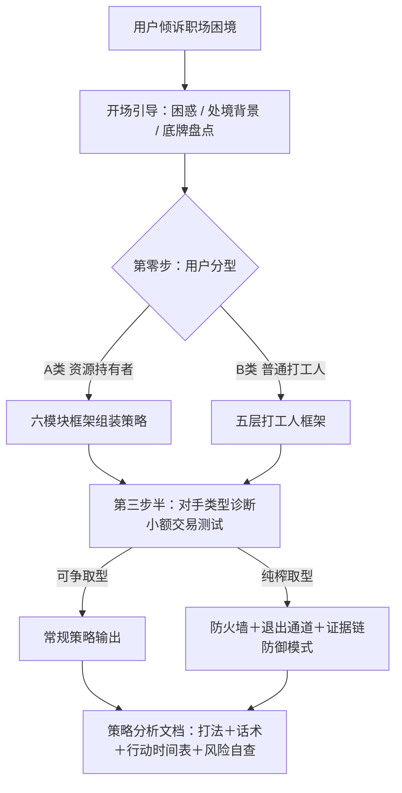

# workplace-game-strategy

<p align="center">
  
</p>

> 职场权力博弈策略分析 —— 一个 Claude Code Skill。
> 用博弈论拆解"怎么和领导相处"：目标不是赢一场冲突，而是在长期重复博弈中改善你的结构性处境。

**中文 | [English](README_EN.md)**

## 它是什么

一个装在 Claude Code 里的职场策略分析技能。当你遇到超额任务分派、扣工资扣绩效、考核威胁、成果侵占、被逼离职这类结构性矛盾时，它不会给你"和为贵"的鸡汤，而是把你的处境拆成一盘棋：**你手里有什么牌，对方的武器依赖什么前提，哪张牌先出、哪张永远握在手里。**

## 核心理论框架

**两类用户，两套打法，先分型再出牌：**

| 分型 | 判定标准 | 核心框架 | 价值来源 |
|---|---|---|---|
| **A类 · 资源持有者** | 手里有"对方想要且稀缺的东西"（稀缺产出、编制、外部网络、不可替代技能） | 六模块组装：合规身份 / 规则内谈判 / 统战价值经营 / 信用风控 / 命门攻防 / 场外底牌 | 统战价值 |
| **B类 · 普通打工人** | 可替代性高，无统战价值 | 五层框架：人力资本通用化 → 书面亮边界 → 全周期留痕 → 小范围串联 → 离职窗口集中主张 | 退出权 ＋ 劳动法规则地形 |

**对手诊断（两套共用）：** 不猜对手是好是坏，用**小额交易测试**——给一次低成本合作机会，观察是否兑现。诊断为"纯榨取型"对手时，框架自动切换为"防火墙＋退出通道＋证据链"防御模式。

## 工作流程



**输出物**是一份完整的策略分析文档：分型与对手诊断 → 处境总判断 → 策略框架 → 具体打法（含话术示例、书面模板、对方可能反应及应对）→ 按周排布的行动时间表 → 风险提示 → 一句话总纲。

## 触发场景

当你对 Claude 说这些话时，技能会自动触发：

- "怎么和领导相处" / "领导给我穿小鞋"
- "被老板压榨" / "扣工资扣绩效怎么办"
- "被安排额外工作怎么拒绝又不撕破脸"
- "考核被卡" / "要不要仲裁/找关系"
- "领导要我署名" / "成果被侵占"

## 案例库

| 案例 | 分型 | 专长/场景 | 看点 |
|---|---|---|---|
| [D博士案例](examples/case-d-phd-research.md) | A类 | 科研专长 | 年产2篇一区top的稀缺产出如何变成统战价值；署名红线"增量可给、存量不让" |
| [L博士案例](examples/case-l-phd-consulting.md) | A类 | 横向项目专长 | 客户与经费在场外时的打法："存量一寸不交割，增量大方一起赚" |
| [M博士案例](examples/case-m-phd-teaching.md) | A类 | 教学与竞赛专长 | 借成果奖申报峰值期把"惯例"换成"制度"；代写红线的拒绝话术 |
| [打工人案例一](examples/case-worker-1-performance-deduction.md) | B类 | 扣绩效＋逼退 | 不主动走、不当场签；攒证据到离职窗口一次性算账 |
| [打工人案例二](examples/case-worker-2-probation-dismissal.md) | B类 | 试用期辞退＋欠薪 | 退出后快速救济：证据封存→书面主张→监察投诉/仲裁的按天行动序列 |

## 安装

本技能遵循 [Agent Skills 开放标准](https://agentskills.io)，纯 Markdown 指令、无脚本依赖，任何兼容该标准的 agent 均可直接使用——只需把整个 skill 目录放进对应 agent 的 skills 目录。

> **安装建议：本技能属于低频触发技能（遇到职场矛盾才用得上），推荐项目级安装、按需使用**——单独建一个目录（如 `~/workplace-advice/`）作为固定的"咨询室"，把 skill 装进该目录的 `.claude/skills/`（或 `.codex/skills/`），需要时在该目录下启动 agent 对话即可。不建议装到用户级：description 会常驻每次启动的技能索引，白白占用上下文。

```bash
git clone https://github.com/peter5991/workplace-game-strategy.git
cd workplace-game-strategy
```

**Claude Code**

```bash
# 项目级（推荐）：复制到项目的 .claude/skills/workplace-game-strategy/ 下
mkdir -p .claude/skills/workplace-game-strategy && cp SKILL.md .claude/skills/workplace-game-strategy/

# 用户级（所有项目可用）
# Windows: 复制 SKILL.md 所在目录到 %USERPROFILE%\.claude\skills\workplace-game-strategy\
# macOS/Linux:
mkdir -p ~/.claude/skills/workplace-game-strategy && cp SKILL.md ~/.claude/skills/workplace-game-strategy/
```

**Codex（OpenAI）**

```bash
# 项目级（推荐）：复制到项目的 .codex/skills/workplace-game-strategy/ 下
mkdir -p .codex/skills/workplace-game-strategy && cp SKILL.md .codex/skills/workplace-game-strategy/

# 用户级
# Windows: 复制 SKILL.md 所在目录到 %USERPROFILE%\.codex\skills\workplace-game-strategy\
# macOS/Linux:
mkdir -p ~/.codex/skills/workplace-game-strategy && cp SKILL.md ~/.codex/skills/workplace-game-strategy/
```

安装后直接描述你的处境即可触发，例如："我是高校老师，领导把全院报销的活都塞给我，怎么办？"

> 提示：其他兼容 Agent Skills 标准的 agent（OpenCode、Cursor、Goose 等）同理，把目录放进各自的 skills 路径即可。若所用模型对长指令遵循度较弱，出现不照"开场引导→分型→诊断"流程走的情况，属于模型行为差异而非格式问题。

## 设计原则

- **真实筹码原则**：分析前必须先盘点用户手里真实的底牌，不虚构筹码——虚构筹码＝策略失效；
- **先查规则原文再定策略**：对方口中转述的规则本身可能就是策略的一部分；
- **威胁握在手里比打出去值钱**：牌打出即贬值，威慑持续产生价值；
- **留痕不是为撕破脸**：是为了谈判有事实、最坏情况能自保；
- **只给合规手段**：不提供违法违规操作；涉及具体法律政策时提示核对原文。

## 边界声明

本技能提供的是**结构性处境分析与合规策略思路**，不构成法律意见。涉及劳动仲裁、编制纪律、地方政策等具体问题，请以法规原文为准，必要时咨询执业律师。所有案例均为假想案例，不指向任何真实个人或机构。

## License

MIT
