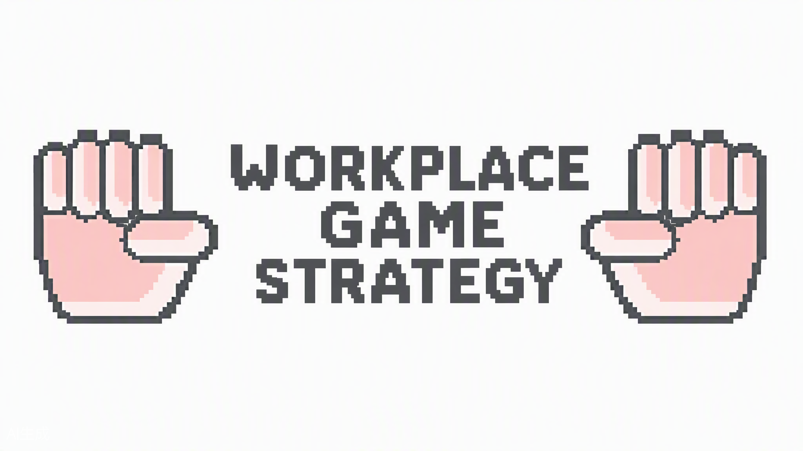
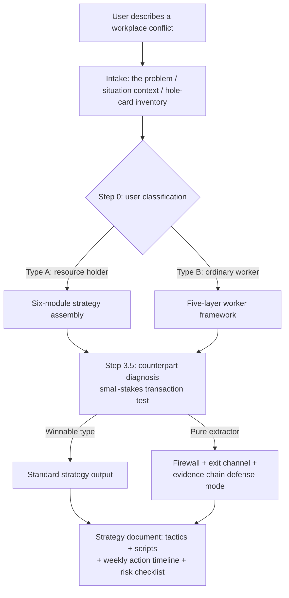

# workplace-game-strategy

<p align="center">
  
</p>

> Workplace power-game strategy analysis — an Agent Skill.
> Game theory for "how do I deal with my boss": the goal is not to win one conflict, but to improve your structural position in a long-term repeated game.

**[中文](README.md) | English**

## What it is

A strategy-analysis skill for agents that support the [Agent Skills open standard](https://agentskills.io) (Claude Code, Codex, and others). When you face structural conflicts at work — excessive task dumping, withheld pay or bonuses, performance-review threats, credit theft, forced resignation — it doesn't give you "just get along" platitudes. It maps your situation as a game: **what cards you actually hold, what preconditions your counterpart's weapons depend on, which card to play first and which to hold forever.**

## Core frameworks

**Two user types, two playbooks — classify before advising:**

| Type | Test | Framework | Source of leverage |
|---|---|---|---|
| **Type A · Resource holder** | Holds something the counterpart wants and can't easily get (scarce output, tenure/establishment, external networks, irreplaceable skills) | Six-module assembly: compliance identity / in-rules negotiation / united-front value cultivation / credit-risk management / vulnerability offense-defense / off-field BATNA | United-front value |
| **Type B · Ordinary worker** | Highly replaceable, no united-front value | Five-layer framework: generalize human capital → put boundaries in writing early → full-cycle paper trail → small-circle coordination → collective claims at the exit window | Exit rights + labor law as rule terrain |

**Counterpart diagnosis (shared):** don't guess whether the other side is reasonable — run a **small-stakes transaction test**: offer one low-cost cooperation and watch whether they honor it. If diagnosed as a "pure extractor," the framework switches to "firewall + exit channel + evidence chain" defense mode.

## Workflow



**Output** is a complete strategy document: classification & counterpart diagnosis → overall situation assessment → strategy map → concrete tactics (with sample scripts, written templates, likely reactions and counters) → week-by-week action timeline → risk checklist → one-line bottom line.

## Trigger scenarios

The skill activates when you say things like:

- "How do I get along with my boss?" / "My manager is sabotaging me"
- "My boss is exploiting me" / "What do I do about withheld pay or bonuses"
- "How to refuse extra work without burning the relationship"
- "My performance review is being held hostage" / "Should I arbitrate or pull strings"
- "My boss wants co-authorship" / "My work is being credited to someone else"

## Case library

> All cases are fictional. They are written for Chinese workplace contexts (academia and private-sector labor law), and serve as worked examples of the frameworks.

| Case | Type | Specialty / scenario | Highlight |
|---|---|---|---|
| [Dr. D](examples/case-d-phd-research.md) | A | Research | Turning 2 top-journal papers/year into united-front value; the authorship red line "trade increments, never stock" |
| [Dr. L](examples/case-l-phd-consulting.md) | A | Industry consulting | When clients and funding live off-campus: "never hand over the stock, share the increment generously" |
| [Dr. M](examples/case-m-phd-teaching.md) | A | Teaching & competitions | Using the award-application peak window to turn "custom" into "written policy"; refusing ghostwriting |
| [Worker case 1](examples/case-worker-1-performance-deduction.md) | B | Withheld bonus + forced resignation | Never resign voluntarily, never sign on the spot; bank evidence and settle accounts at the exit window |
| [Worker case 2](examples/case-worker-2-probation-dismissal.md) | B | Probation dismissal + unpaid wages | Post-exit rapid relief: evidence lockdown → written demand → labor-inspector complaint / arbitration, day by day |

## Installation

This skill follows the [Agent Skills open standard](https://agentskills.io) — pure Markdown instructions, no scripts or tool dependencies. Any compatible agent can use it as-is: just drop the skill folder into the agent's skills directory.

> **Install recommendation: this is a low-frequency skill (you only need it when a workplace conflict arises), so prefer project-level installation and use it on demand.** Create a dedicated "consulting room" directory (e.g. `~/workplace-advice/`), place the skill under its `.claude/skills/` (or `.codex/skills/`), and start your agent session in that directory when needed. User-level installation is not recommended: the description would sit in the skill index at every startup, costing context for nothing.

```bash
git clone https://github.com/peter5991/workplace-game-strategy.git
cd workplace-game-strategy
```

**Claude Code**

```bash
# Project-level (recommended): copy into your project's .claude/skills/workplace-game-strategy/
mkdir -p .claude/skills/workplace-game-strategy && cp SKILL.md .claude/skills/workplace-game-strategy/

# User-level (available in all projects)
# Windows: copy the folder containing SKILL.md to %USERPROFILE%\.claude\skills\workplace-game-strategy\
# macOS/Linux:
mkdir -p ~/.claude/skills/workplace-game-strategy && cp SKILL.md ~/.claude/skills/workplace-game-strategy/
```

**Codex (OpenAI)**

```bash
# Project-level (recommended): copy into your project's .codex/skills/workplace-game-strategy/
mkdir -p .codex/skills/workplace-game-strategy && cp SKILL.md .codex/skills/workplace-game-strategy/

# User-level
# Windows: copy the folder containing SKILL.md to %USERPROFILE%\.codex\skills\workplace-game-strategy\
# macOS/Linux:
mkdir -p ~/.codex/skills/workplace-game-strategy && cp SKILL.md ~/.codex/skills/workplace-game-strategy/
```

Then just describe your situation, e.g. "I'm a university lecturer and my dean dumped the whole department's expense-report work on me — what do I do?"

> Note: other Agent-Skills-compatible agents (OpenCode, Cursor, Goose, etc.) work the same way — place the folder in their respective skills paths. If a model with weaker long-instruction adherence skips the "intake → classification → diagnosis" order, that's a model-behavior difference, not a format problem.

## Design principles

- **Real-cards principle**: inventory the user's actual hole cards before analyzing — fabricated leverage means a failed strategy;
- **Read the rules before choosing a strategy**: the rules as relayed by your counterpart may themselves be part of their strategy;
- **A threat held is worth more than a threat played**: a played card depreciates; deterrence keeps compounding;
- **Paper trails aren't for burning bridges**: they give negotiations facts and give you a floor in the worst case;
- **Compliant means only**: no illegal or rule-breaking tactics; verify the actual text of laws and policies when they come up.

## Disclaimer

This skill provides **structural situation analysis and compliant strategy thinking**, not legal advice. For labor arbitration, employment-system discipline, or local regulations, defer to the authoritative legal texts and consult a licensed attorney where needed. All cases are fictional and do not refer to any real person or organization.

## License

MIT
